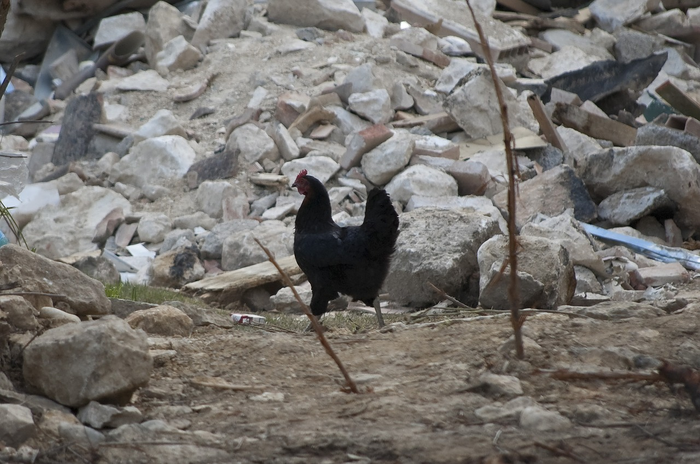

```{r setup, include=FALSE}
knitr::opts_chunk$set(echo = FALSE)
```



## Description 

* Source of the article: Max Planck Gesellschaft
https://www.sciencedaily.com/releases/2020/07/200706101837.htm 

* Publication date: july 6th 2020, Science Daily

* Word count: 966 words of the article

## Vocabulary

**Word from the text** | **Synonym/definition in English** | **French translation**
-----------------------|-----------------------------------|--------------------------
Early                  |Soon/time : in the first part      |Tôt                       
Earthquake             |It is the result of a sudden release of energy in the Earth's crust that creates seismic waves/seismic tremor                                       |tremblement de terre/séisme
Reliably               |dependably,certainly,...           | de manière fiable                         
Eyewitness             |person who has seen a specific event/onlooker   |témoin occulaire                      
Animal Behavior        |the way an animal functions in a particular situation/animal:habits                              |comportement des animaux
Whether                | It is conjunction to choice between two possibilities/if  |si                  
Sensor                 |electronic device that delects something  |capteur, détecteur
Several                |a few,some,...                     |plusieurs
Restless               |it is unable to stay still/fidgety |agité
Impending              |coming soon/imminent               |imminent
Clue                   |some information that helps the researches/evidence,hint  |indice
Nevertheless           |however,even so,all the same       |néanmoins,toutefois
Advance                |development in a particular activity/progress |avance
Nesting                |bird: build a nest                 |nidification
Account                |report,explanation                 |compte
Stand up               |place upright,remain true          |se lever,relever
Scrutiny               |careful and complete examination/investigation  |examen, contrôle
Unclear                |animal:not understand fully/inaccurate |pas clair
Pattern                |arrangement,configuration,system,... |motif, disposition
Strongly               |fervently/forcibly                 |fortement
Trigger                |set in motion/provoke              |provoquer, déclencher
Instead                |in preference of something/in place of something |plutôt
Event                  |especially something important/occurence |événement
Ensure                 |to make sure that something happens/guarantee |assurer
Draw                   |to make pictures/doodle            |dessiner
Disturbance            |that disturbs something or somebody/commotion |dérangement
Weak                   |unable to exert force/low          |faible
Shock                  |a strong feeling of surprise as a result of something happening/impact |choc
Collar                 |strap around neck of a animal/necklace  |collier
Least                  |smallest possible quantity/littlest  |moins
Shake                  |to move with short quick movements side to side/tremble |secouer
Fund                   |provide money for something/pay for |financer
Carry out              |to complete a task/perform  |effectuer
accelerometer          |an instrument for measuring acceleration | accéléromètre

## Analysis about study

**Researches?**

  * the Max Planck Institute of Animal Behavior and Principal Investigator at the Centre for the Advanced Study of Collective Behaviour.(Max-Planck-Gesellschaft)

**Published in, when?**

  * on Science daily (6 july 2020)

**General topic**

1. Animals behave unusually before an earthquake.So there is a study on their animal behavior before seismic tremor.

    * The animals had unusual behaviour before a quake -> very restless. 

2. The scientists attached sensor to the animals to detect their movements during several months.

  => The objective is to anticipate an impending earthquake through animal movements.

**Procedure, what was examined**

* Firstly, the different animals (cow, sheep and dog) had a collar during several months (1800 quakes, 12 strong quakes ). 

* Secondly, the study was in comparison on different factors (= the size, the speed, the species,...)

**Conclusion or discovery**

* the unusual behaviour is a sign of 20 hours before seismic tremors. 

* The nearer animals are to earthquake, the faster their behaviour changes.

**Remaining questions**

* a new project = observe more animals at long term in earthquake of area (system Icarus on the International Space Station (ISS)). 

* A another remaining question : "how animals can sense impending earthquakes?"
    * Several hypothesis exist: smell the quartz of gas / feel the pressure strong of the rocks.
