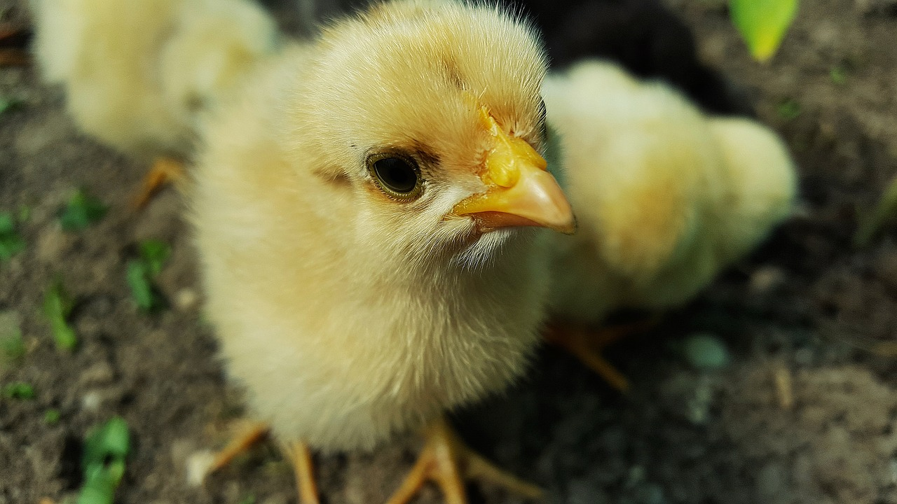

```{r setup, include=FALSE}
knitr::opts_chunk$set(echo = FALSE)
```



## Description

* Source of the article: University of Plymouth, https://www.sciencedaily.com/releases/2020/06/200609190730.htm

* Publication date: june 9th 2020, Science Daily

* Word count: 625 words of the article

## Vocabulary

**Word from the text** | **Synonym/definition in English** | **French translation**
-----------------------|-----------------------------------|------------------------------
Low cost               |Below the usual cost/Cheap price   |Bas coût                     
Chick                  |A Baby bird (often a baby chicken) |Poussin
Welfare                |The general well-being of an individual or group of individual/happiness,good,... | Bien-être
To Pick up             |to get better,stronger/to improve     |remonter
Newly                  |recently,freshly                   |nouvellement
To Hatch               |animals from eggs/to brood,to incubate,...|éclore
Batch                  |a number of people or things that are dealt with as a group/group|lot, groupe
Surrounding            |that is near something/all around, environment,...|environnant
Loud                   |making a lot of noice/noisy        |bruyant
Distress               |need for help/worry                |détresse
To Link                |To connect/to joint,to bond,...             |relier, lier
Flock                  |a group of birds of the same type/herd |troupeau
Rate                   |a measurement of the speed at which something happens/ratio |taux
Barn                   |a large farm building for keeping animals in/farm building |grange
To Settle              |to make a home/to live                   |installer
Whereas                |while in contrast/while            |tandis que
To Involve             |if a situation, an event or an activity involves something, that thing is an important or necessary part or result of it/ to entail |impliquer,supposer
Soundscape             |An atmosphere or environment created by or with sound/sound landscape|paysage sonore
Tonal                  |relating to tone                   |tonal
Overall                |generally/including all the things or people that are involved in a particular situationy |en général, dans l'ensemble
Computationally        |involving calculation/computational |informatique
Staff                  |all the workers employed in an organization considered as a group/ personnel|personnel
Livestock              |the animals kept on a farm/farm animals| bétail
To Emphasise           |to give special importance to something/to say |souligner
Alongside              |beside, next to                   |à côté de
Monitoring             |to watch and check something over a period of time in order to see how it develops, so that you can make any necessary changes/ observing, listening   |surveillance
Poultry                |chickens kept for their meat or eggs/ chicken |volaille

## Analysis about study

**Researches?**

  * University of Plymouth, University of Roehampton, SRUC, and Newcastle University.
  
**Published in, when?**

  * Journal of the Royal Society Interface (9 june 2020)
  
**General topic**
  
  * method easy and low-cost -> listening to chick = resolve welfare problem as soon as possible
  
  * nature: loud and distinctive chick's distress cry above other noises.
  
    * causes discomfort in the environment or other.
  
**Procedure, what was examined**

  * acoustic recording = 12 typical flocks of 25,000 chicks
  
  * the first day: all chicks cry ->  a new strange environment. After , the cry chicks less (accustomed by the environment).
  
    * tool use at the right time (simple intervention for animals welfare) => use early in life,bring an improvement
    
    * work not additional to the farmer.
    
  * method study: Soundscape (sound more tonic at the chicks) -> alarm precocious to the farmer
  
**Conclusion or discovery**

  * advantage for surveillance (danger alarm)
  
  * improve welfare behavioral and emotional animal centric
  
**Remaining questions**

  * vocalization = very important for animals. 
  
  * so a lot of study new future.
  
    -> to progress in precision livestock farming.
