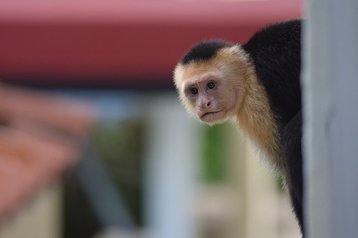

```{r setup, include=FALSE}
knitr::opts_chunk$set(echo = FALSE)
```



## Description

* Source of the article: Max-Planck-Gesellschaft, https://www.sciencedaily.com/releases/2020/06/200622133020.htm

* Publication date: June 22th 2020, Science Daily (Nature Ecology & Evolution )

* Word count: 617 words of the article

## Vocabulary

**Word from the text** | **Synonym/definition in English** | **French translation**
-----------------------|-----------------------------------|---------------------------------
Lockdown               |mass quarantine to control disease/confinement |Confinement
reveal                 |to make something known to somebody /show,disclose |Révéler
wildlife               |animals that are wild and live in a natural environment/animals |faune
devastating            |causing a lot of damage and destroying things/catastrophic |dévastatrice
crisis                 |a time of great danger, difficulty or doubt when problems must be solved or important decisions must be made/emergency |crise
increasingly           |more and more/progressively |De plus en plus
crowd                  |to form a group of people/group |peupler, s'attrouper
both                   |the one as well as the other/the two |tous les deux 
spread                 | the act of spreading ideas or information among many people/extention |Propagation
reduce                 |to make something less to become less/decrease |réduire
insight                |an understanding of what something is like/perception |perspicacité
countless              |too many to be counted or mentioned/very many |d'innombrables
encounter              |experience a problem/run into |rencontrer
spotted                |having a regular pattern of small dots on it/dotted |tacheté
prowl                  |to move quietly and carefully around an area, especially when hunting/slink |rôder
show up                |to arrive where you have arranged to meet somebody or do something/appear |faire apparaître
urban-dwelling         |group of dwellings such that none is separated from the nearest/city |habitation urbain
struggle               |to try very hard to do something when it is difficult or when there are a lot of problems/strive |épreuve
poaching               |the illegal practice of hunting or fishing/hunt illegally  |braconnage
tackle                 |
hardship               |
argue                  |
nifty                  |
device                 |
field                  |
tracking               |
goldmine               |
attempt                |
landscape              |
unforeseen             |

## Analysis about study

**Researches?**


**Published in, When?**


**General topic**


**Procedure, what was examined**


**Conclusion or discovery**


**Remaining question**


