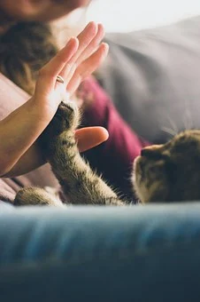

```{r setup, include=FALSE}
knitr::opts_chunk$set(echo = FALSE)
```




## Description

* Source of the article: University of Sussex https://www.sciencedaily.com/releases/2020/10/201007123031.htm

* Publication word: October 7th 2020, Science daily

* Word count: 971 words of the article

## Vocabulary

**Word from the text** | **Synonym/definition in English** | **French translation**
-----------------------|-----------------------------------|---------------------------
Paw                    |the foot of an animal that has claws or nails/pad |Patte
Purr-fect              |cat:vibrating sounds/purring       | Ronronnement
Slow blink             |eyes:slow opening-and-closing/slow wink |Clignement lent
Parallel               |two or more lines that are parallel to each other are the same distance apart at every point/line | Parallèle
Genuine                |real; exactly what it appears to be; not artificial/authentic |Véritable
To Lead                |to go with or in front of a person or an animal to show the way or to make them go in the right direction/to guide |guider
To Reveal              |to make something known to somebody/to show |révèler
Owner                  |a person who owns something/possessor    |Propriétaire 
To Outstretch          |to hold out/to extend                          |étendre
To Deliver                |to give or send information or ideas to somebody/to give | Prononcer
To Investigate         |to carefully examine the facts of a situation to find out the truth about it or how it happened/to examine |enquêter
To Enhance                |to increase or further improve the good quality, value or status of something/to improve |améliorer
Bond                   |something that forms a connection between groups, such as a feeling of friendship or shared ideas and experiences/link |lien
ability                |ability to do something the fact that somebody is able to do something/capacity |capacité
To assess              |to make a judgement about the nature or quality of something/to evaluate |évaluer
Including              |having something as part of a group or set/as well as |y compris
Shelter                |the fact of having a place to live or stay, considered as a basic human need/refuge |abri
To Argue that             |with clause: to assert,to maintain |soutenir que
Reward                 |Cats may have learned that humans reward them for responding to slow blinking/compensation |récompense
To Stare               |to look at somebody for a long time/to gape |fixer 
Threatening            |expressing a threat of harm or violence/gesturing |menaçant
Significance           |the importance of something, especially when this has an effect on what happens in the future/importance |importance
To Include             |if one thing includes another, it has the second thing as one of its part/to contain |comprendre
Household              |all the people living together in a house or flat/home |foyer
Flat                   |the flat of something the flat level part of something/level |plat
Palm                   |front of the hand/frond |paume
Upward                 |pointing towards or facing a higher place/higher |vers le haut
Whilst                 |during the time that something is happening; at the same time as something else is happening/when |bien que
To Crouch             |to put your body close to the ground by bending your legs under you/to squat |s'accroupir
Cue                    |an action or event that is a signal for somebody to do something/ signal |signal
To Rub                 |to press two surfaces against each other and move them backwards and forwards; to be pressed together and move in this way/to stroke |frotter
To Butt                | if an animal butts somebody, it hits them or it hard with its head/to hit |buter,cogner
Sad                    |feeling sorrowful/unhappy |triste

## Analysis about study

**Researches?**

  * the Universities of Sussex and Portsmouth

**Published in, when?**

  * in the Nature journal Scientific Reports (7 october 2020)

**General topic**

  * creation a bond with cats thanks to an eye narrowing technique with them
  
    * for a cats, an eye narrowing = a genuine smile (a positive situation for another species)
    
  * known means of communication:
  
    * the purring attract, recognize their name (cats), sensitive emotional signals

  * advantage more communication: 
    
    * improve the public understanding of cats, improve cats welfare, more about their socio-cognitive abilities .

**Procedure, what was examined**

 * the meaning of the slow blink in cat-human communication
 
1. 21 cats from 14 different households, 10 cats male and 11 cats female, age between 0,45 and 16 years.
  
    * the cat's owner on slow blink.
    * Cat's settling up at the same place -> the owner approximately 1 m away from the cat
    
2. 24 extra cats from 8 different household, 12 cats male and 12 cats female, age between 1 and 17 years.
  
    * Researchers (cats don't know) with slow blink
    * Researchers (cats don't know) without slow blink
    
 => This experiment also test -> the cats approach the unfamiliar experimenter = a flat hand with palm faced upwards to offer the cat . 

**Conclusion or discovery**

  * if human make slow blink and slow down the eyes -> more the cats approach you (one more form of communication)
  
  * the cats also -> a slow blink and slow down the eyes

**Remaining questions**

  * study not easy natural cat behaviour
  
  * the next studies = assess the welfare of cats in veterinary practices or shelters

