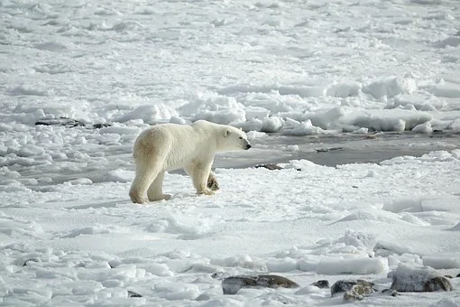

```{r setup, include=FALSE}
knitr::opts_chunk$set(echo = FALSE)
```




## Description

* Source of the article: University of Maryland https://www.sciencedaily.com/releases/2020/11/201105183834.htm

* Publication word: November 5th 2020, Science daily

* Word count: 854 words of the article

## Vocabulary

**Word from the text** | **Synonym/definition in English** | **French translation**
-----------------------|-----------------------------------|---------------------------
Climate change         | the increase in temperature of the earth’s atmosphere that is caused by the increase of carbon dioxide /Global warming |Changement climatique
Behavioral             | Connected with the scientific study of animal behaviour/of behavior |Comportemental
Unexpected             | it surprises you because you were not expecting it/surprising | imprévu, inattendu
Across                 | From one side to other/through |à travers
Moose                  | a large deer that lives in North America. In Europe and Asia/elk |élan
Feasibility            | the quality of being possible and likely to be achieved/viability |Faisabilité
Global                 | covering or affecting the whole world/Worldwide |Mondial
To Cover               | to place something over or in front of something in order to protect /protect | Couvrir
Landscape              | everything you can see when you look across a large area of land, especially in the country/view |Paysage
Agency                 | an organization, company, or bureau that provides a particular service/service |Agence
Jurisdiction           | the right, power, or authority to administer justice by hearing and determining controversies/authority |Juridiction
To Spend               | to pay out money,resources/pay |dépenser
Throughout             | in or into every part of something/all over |tout au long de
To Convey              | to make ideas known to somebody/communicate |communiquer
To Include             | to contain or have as part of a whole/contain |comprendre 
Tracking               | to make somebody/something part of something/path |pistage,suivi
Lowland                | connected with an area of land that is fairly flat and not very high above sea level/low-lying region | plaines
Woodland               | land full of trees/wood | bois
Tricky                 | difficult to do or deal with/difficult | difficile
Calf                   | an animal/young cow | veau
Unprecedented          | that has never happened, been done or been known before/unique |sans précédent 
Harsh                  | cruel, severe and unkind/rigid |sévère
Inquiry                | a seeking or request for truth, information, or knowledge/investigation |enquête
Forward                | towards a place or position that is in front/onward | en avant
To Lead                |to go before or with to show the way/guide | guider
Golden eagles          | large bird of prey/bird | Aigle royal
To Shift               | to move from one place, person, etc., to another/move | déplacer
Decade                 | a period of ten years/ten years | décennie
Predator               | any organism that exists by preying on another/hunting animal | Prédateur
Prey                   | an animal hunted for food/target | proie
Whether                | a castrated male sheep/sheep | mouton
Baseline               | a basic standard/guideline | référence


## Analysis about study

**Researches?**

  * The University of Maryland

**Published in, when?**

  * In journal Science (6 november 2020)

**General topic**

  * Biologist -> a data archive of animal movement studies in relation to climate change
  
    * from across the global Arctic and sub-Arctic (most affected by global warming)
    
  * 3 studies -> show surprising trends and associations between climate change and animal behavior
  
    * animals study -> golden eagles, bears, caribou, moose and wolves

**Procedure, what was examined**

  * difficult to study general tendency of animal behavior
   
    * Cause :
      
      -> animal ecology not studied in landscapes (cover entire regions on earth) 
      
      -> data needed in various organizations and jurisdictions (not available and not standardized)
    
    * Solution : creation of a relationship with scientists from national governments, regions and first nations and research groups from all over the Arctic
    
      -> global repository = Arctic Animal Movement Archive (AAMA)
      
      -> more than 100 universities, government agencies and groups conversation of 17 countries
  
  * Data from 201 monitoring studies of terrestrial and marine animals (8000 animals between 1991 and today)
  
  * First study = movement of 900 female caribou from 2000 to 2017 (University of Mayland)
  
  * Second study = movement of over 100 golden eagles from 1993 to 2017 (University Columbia)
  
  * Third study = examine the speed of movement of bears, caribou, moose and wolves from 1998 to 2019 (University Washington)
  
  * analysis tools -> the same for each of the studies

**Conclusion or discovery**

  * Result of the first study :
    
    * Migratory caribou -> give birth earlier in the spring (depending on the rate of warming)
    
    * Non-migratory caribou -> only the northern subpopulations = same as the migrants
    
    => give birth earlier -> grow during the summer season but don't have time to reach the optimal calving grounds
  
  * Result of the second study :
  
    * immature birds -> migrating north in the spring arrived earlier following mild winters (not adult birds)
    
    => The timing shift for young birds -> response to climate change,
    age-related behavior changes ->only through decades of movement data 
  
  * Result of the third study :
  
    * species -> react differently to seasonal temperature and winter snow conditions 
    
    => Those differences -> influence species interactions, food competition and predator-prey dynamics.

**Remaining questions**

  * Other scientists continue to use AAMA -> Answer to questions about the reaction of animals to the evolution of the Arctic side
  
  * AAMA continue to have more and more data
  
  * essential to understand their behavior to predict their reaction to global warming.
