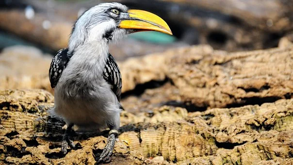

```{r setup, include=FALSE}
knitr::opts_chunk$set(echo = FALSE)
```




## Description

* Source of the article: University of Exeter https://www.sciencedaily.com/releases/2021/02/210205104233.htm

* Publication word: Februari 5th 2021, Science daily

* Word count: 665 words of the article

## Vocabulary

**Word from the text** | **Synonym/definition in English** | **French translation**
-----------------------|-----------------------------------|---------------------------
Captive                | kept or held in confinement/confined |Captive
To House               | to provide with a place/to domicile | Abriter
Likewise               | moreover/also | De même
Wild                   | living in a natural and untamed environment/savage | Sauvage
To Link                | To connect/to joint,to bond,... | Relier
Field                  | a large area or expanse of anything/terrain | Terrain
To Gather              | information : collate/collect | Recueillir
Breeding               | raising animal/species | élevage
To Promote             | to help or encourage to flourish/to advertise | Promouvoir
Commoner               | a person who does not come from a royal or noble family/ common man | roturier, roturière
Sustainability         | ecology: renewability/durability | Durabilité
Rainforest             | dense woodland in rainy region/cloud forest | Forêt tropicale
Helmeted               | wearing a helmet    | Casqué
Hornbill               | a tropical bird with a very large curved beak | Calao
Dispersal              | the act of dispersing or of being dispersed/scattering | Dispersion
Pristine               | having its original purity/natural | vierge,pur
Whilst                 | while/although   | Bien que
Enclosure              | enclosed area for animals/pen | enclos
Nesting                | bird: building a nest/den | Nidification
To Hatch               | to break out of an egg/to incubate | éclore
To Enable              | to make able/to facilitate | permettre
Kingfishers            | a bird with a long beak that catches fish in rivers. The European kingfisher is small and brightly coloured and the American kingfisher is larger and blue-grey in colour. | Martin-pêcheur
Reliant                | having or showing dependence/dependent | Dépendant
Neighbouring           | located or living near or next to a place or person/adjacent | Voisin
Amongst                | in, into, or through the midst or middle of/among | au milieu de
Expertise              | expert skill or knowledge/competence | compétence
To Fledge              | to bring up (a young bird) until it is able to fly/to flight |se couvrir de plumes, voler

## Analysis about study

**Researches?**

  

**Published in, when?**

  

**General topic**

  

**Procedure, what was examined**

 

**Conclusion or discovery**

  

**Remaining questions**

  
