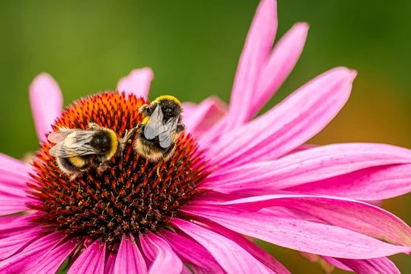

```{r setup, include=FALSE}
knitr::opts_chunk$set(echo = FALSE)
```




## Description

* Source of the article: University of Sussex https://www.sciencedaily.com/releases/2021/02/210210091131.htm

* Publication word: Februari 10th 2020, Science daily

* Word count: 688 words of the article

## Vocabulary

**Word from the text** | **Synonym/definition in English** | **French translation**
-----------------------|-----------------------------------|---------------------------
Honey bee              | any bee that collects and stores honey/honey-producing flying insect | Abeille mellifère
Bumblebee              | a large bee covered with small hairs that makes a loud noise as it flies | Bourdon
Widespread             | spread over a wide area/extensive | étendu
Foraging               | the acquisition of food by hunting, fishing, or the gathering of plant matter/hunting for food | recherche de nourriture
to Mediate             | to attempt to settle (a dispute) between two opposing sides/ arbritate | servir de médiateur
Bodyweight             | amount a person weighs/weight | poids
Efficiency             | the state or quality of being efficient, competency in performance/competence | efficience
Reverse                | opposite or contrary in position, direction, order, etc./opposite | contraire
Nearby                 | near in position/Close | à proximité
To Gather              | to bring or come together into one group, collection, or place/come together | réunir
Stopwatch              | a watch with a hand or counter that can be stopped or started at any instant, used for precise timing, as in races/timing device | chronomètre
To Compensate          |  to provide something good to balance or reduce the bad effects of damage, loss, etc./pay |Dédommager
Ling heather           | a heath plant having small pinkish purple flowers/plant | Petit bruyère
Nimble                 | quick and light in movement/agile | agile
Tightrope              | a risky or delicate situation | corde raide
Reassuring             | making you feel less worried or uncertain about something/comforting | réconfortant
To Predominate         | to be the stronger or leading element or force/prevail | prédominer
Allotment              | a small area of land in a town that a person can rent in order to grow fruit and vegetables on it/portion | Lotissement (jardin ouvrier)
Cutting                | a piece, such as a root or leaf, cut from a plant and used to start a new plant/biting | coupe
Pollinator             | something, such as an insect, that carries pollen from one plant or part of a plant to another/agent that transfers pollen | Pollinisateur
Advantage              | circumstance, opportunity, etc., that is very favorable to success/lead | avantage,atout
Head                   | the position at the front of a line of people/face | tête
Garden                 | a piece of land next to or around your house where you can grow flowers, fruit, vegetables, etc., usually with a lawn (= an area of grass)/plot of land | Jardin
Blooming               | Flowering/in flower | en fleur
Grass                  | an area of ground covered with grass/pasture | Gazon

## Analysis about study

**Researches?**

  

**Published in, when?**

  

**General topic**

  

**Procedure, what was examined**

 

**Conclusion or discovery**

  

**Remaining questions**

  
