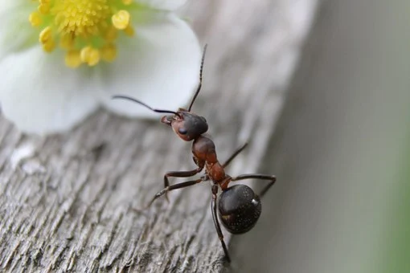

```{r setup, include=FALSE}
knitr::opts_chunk$set(echo = FALSE)
```




## Description

* Source of the article: Martin-Luther-Universität Halle-Wittenberg https://www.sciencedaily.com/releases/2020/11/201103104730.htm 

* Publication word: November 3th 2020, Science daily

* Word count: 474 words of the article

## Vocabulary

**Word from the text** | **Synonym/definition in English** | **French translation**
-----------------------|-----------------------------------|---------------------------
Ant                    | a small insect that lives in highly organized colonies/ Emmet | Fourmi
To swallow             | to make food, drink, etc. go down your throat into your stomach/to consume | Avaler 
Germ                   | a very small living thing that can cause infection and disease/microbe | Germe
Formic acid            | an acid made from carbon monoxide and steam, It is also present in a liquid produced by some ants/methanoic acid | Acide formique
Harmful                | causing or capable of causing harm/ damaging | Nocif, nocive
Intestinal flora       | microorganisms in the intestines |Flore intestinale
Long-standing          | existing or in effect for a long time/long-term | De longue date
To ward off            | to turn aside or repel, avert/to keep away | éloigner
To Brood               | to sit upon eggs that will be hatched/to hatch | Couvée
To Spread              | to cover a larger and larger area/expansion | Propagation
Hindquarter            | the rear part of a four-legged animal/rear axle | arrière-train
Afterward              | after an earlier event or time/subsequently | Après
To figure out          | to think about something until you understand them/To understand | Comprendre
To disinfect           | to cleanse of infection/purify | Désinfecter
To enrich              | to supply with riches or wealth/to improve | enrichir
Mate                   | a sexual partner of an animal/match | partenaire
Infection              | the state of being infected/contamination | maladie infectieuse
To ingest              | to take into the body, as food or liquid/take in food | ingérer
Ill                    | sick, unwell, of poor health/unhealthy | malade
To act                 | anything done or to be done/take action | Agir
Handful of             | a small quantity/few | une poignée de 
Gut                    | the inner organs of the body, the bowels / stomach | du ventre

## Analysis about study

**Researches?**

  * Martin Luther University Halle-Wittenberg (MLU) and the University of Bayreuth 

**Published in, when?**

  * in the journal eLife (03 November 2020)

**General topic**

  * Ants -> use their own acid 
  
    * to disinfect themselves and their stomachs
      
      * kill harmful bacteria in food
      
      * improve the intestinal flora of the ant
      
    * formic acid = one of the simplest organic acids (produced in a special gland in the abdomen for many ants)

**Procedure, what was examined**

  * long-standing hypothesis -> acid purpose to ward off predators 
    
    * add in hypothesis -> also use for brood care
    
  * new study on ant -> swallowing food or water after cleaning the hindquarters
  

**Conclusion or discovery**

  * not linked to digestion -> do this even after ingesting only water
  
  * several experiments -> internal disinfection of the ant by itself
    
    * with acid -> chance of survival increases
    
    * transmit their food with acid to their partner -> decrease risk of disease
    
   => this behavior -> decrease in germ propagation in an ant colony
   
  * some ant -> less bacteria in digestive tract (except acid-resistant microbes)
  
    * acid = filter mechanism (organizes the ant microbiome)
    
    * extremely acidic ant stomach (rare in animals)
  
**Remaining questions**

  * a mystery still for the precise functioning of formic acid
 
