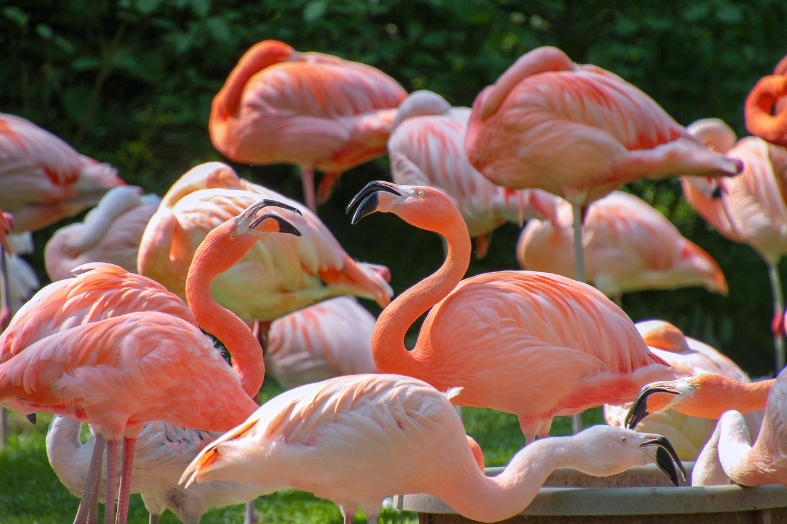

```{r setup, include=FALSE}
knitr::opts_chunk$set(echo = FALSE)
```




## Description

* Source of the article: University of Exeter https://www.sciencedaily.com/releases/2020/06/200607195010.htm

* Publication word: June 7th 2020, Science daily

* Word count: 481 words of the article

## Vocabulary

**Word from the text** | **Synonym/definition in English** | **French translation**
-----------------------|-----------------------------------|---------------------------
Flamingo               | a large pink bird with long thin legs and a long neck, that lives near water in warm countries/Large pink bird | Flamant (rose)
Bright                 | strong and easy to see/intense | Brillant 
Pale                   | lacking strong or natural color/dull | pâle
To Flush               | to animate,inflame/to redden | s'enflammer
To Squabble            | to quarrel about a small detail/to fight | Se chamailler
To fight               | to take part or contend in single combat/to battle | lutter contre
Available              | that you can get or find/usable | Disponible
To feed                | to give food to an animal/to provision | Nourrir
Carotenoid             | any of a group of red or yellow pigments, including carotenes, found in plants and certain animal tissues/natural pigment: yellow to red | Caroténoïde
Algae                  | very simple plants, such as seaweed, that have no real leaves, stems or roots, and that grow in or near water/seaweed | Algue
To filter              | to remove by the action of a filter/to separate with a filter | filtrer
Feeder                 | an animal that eats in a particular way/animal food | Mangeoire
Indoor                 | located, used, or existing inside a building/inside | à l'intérieur
Bowl                   | a deep, round dish or basin, used chiefly for holding liquids, etc./dish | Bol
Pool                   | a small body of standing water/a small pond | Piscine
Foraging               | the acquisition of food by hunting, fishing, or the gathering of plant matter/gathering |recherche de la nourriture
Spacious               | containing much space,roomy/large | spacieux 
Aggression             | the action of making unprovoked assaults or attacks against another, esp. so as to dominate/offensive | aggressivité
Huge                   | extremely large in size or amount/vast | énorme
Breeding               | the keeping of animals in order to breed from them/rearing | élevage
Enough                 | adequate or sufficient for the purpose/sufficient | assez de 
to display             | to show or make visible/to show off | montrer
Feather                | one of the light, horny structures that form the principal covering of birds/plumage | Plume
Tiring                 | causing a feeling of tiredness/that makes you tired | Fatigant
Parenthood             | the state, position, or relation of a parent | Parentalité
Keepers                | a person who assumes responsibility for another's behavior /guard | guardien
Willing                | consenting,agreeing,inclined/ready | Prêt
Rate                   | the amount of a charge or payment with reference to some basis of counting/ratio | taux

## Analysis about study

**Researches?**

  * the University of Exeter and WWT Slimbridge Wetland Centre

**Published in, when?**

  * On Ethology (08 June 2020)

**General topic**

  * 

**Procedure, what was examined**


  

**Conclusion or discovery**


  
**Remaining questions**


