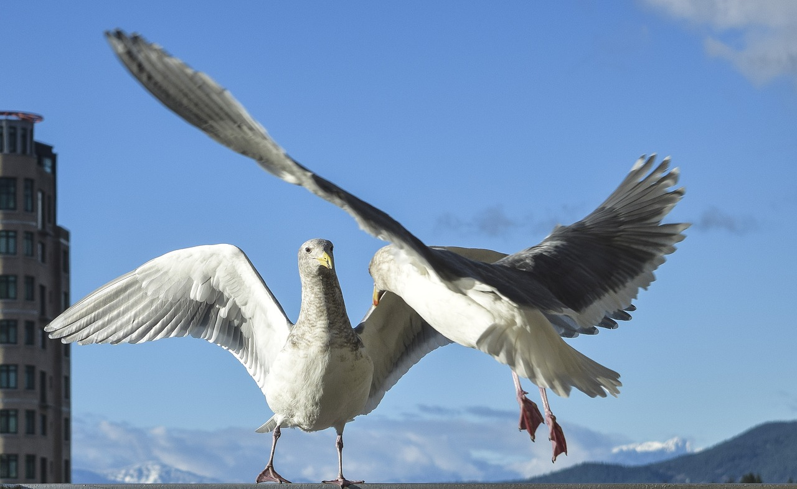

```{r setup, include=FALSE}
knitr::opts_chunk$set(echo = FALSE)
```




## Description

* Source of the article: University of Exeter https://www.sciencedaily.com/releases/2020/11/201110133202.htm

* Publication word: November 10th 2020, Science daily

* Word count: 550 words of the article

## Vocabulary

**Word from the text** | **Synonym/definition in English** | **French translation**
-----------------------|-----------------------------------|---------------------------
Fighting               | the activity of being involved in a battle against an enemy/combat | Combat
Factor                 | one of several things that cause or influence something/element | Facteur
Whether                | used to express a doubt or choice between two possibilities/if | Si
Rival                  | a person, company or thing that competes with another in sport, business, etc./adversary | Rival
Opponent               | a person that you are playing or fighting against in a game, competition, argument, etc./adversary | Adversaire
Outcome                | a final product or end result,consequence/issue | issue
To overlook            | to fail to notice or think about, not see the importance of/to command | Négliger, oublier
Instead                | as a substitute,in place of someone or something/alternatively | plutôt
To Weigh up            | to make an assessment of a person, situation, etc, judge/ to consider | comparer
To assess              | to evaluate the importance or character of something/to evaluate | évaluer
Dyadic                 | consisting of two parts/based on two | Dyadique
Framework              | a set of beliefs, ideas or rules that is used as the basis for making judgements, decisions, etc./structure | Cadre
Contest                | a competition in which people try to win something/competition | Concours
To Highlight           |  to emphasize something, especially so that people give it more attention/to text | souligner
Strong                 | having a lot of physical power so that you can lift heavy weights, do hard physical work, etc./robust | Fort
To overcome            | to succeed in dealing with or controlling a problem that has been preventing you from achieving something/to win | vaincre 
Meerkat                | a small southern African animal with a long tail, which often stands up on its back legs. Meerkats are a type of mongoose | Suricate
Pup                    | the young of certain other animals/puppy | jeune,chiot,...
Narrow                 | measuring a short distance from one side to the other, especially in relation to length/thin | étroit
Entrance               | the act of entering a room, building or place, especially in a way that attracts the attention of other people/entry | entrée
Baboon                 | a large African or Asian monkey with a long face like a dog’s/large monkey | Babouin
To Avoid               | to prevent something bad from happening/to evade | éviter
Scope                  | the opportunity or ability to do or achieve something/potential | cadre
Warfare                | the activity of competing in an aggressive way with another group/conflict | Lutte
Funder                 | a person or an organization that provides money for a particular purpose/backer |  bailleurs de fonds
Collectively           | in a way that is done or shared by all members of a group of people; in a way that involves a whole group or society/together | Collectivement

## Analysis about study

**Researches?**

  * the Universities of Exeter and Plymouth

**Published in, when?**

  * in Ecology & Evolution (10 November 2020)

**General topic**

  * Before one-on-one fights, animals -> to make decisions based on factors 
    
    * the size and strength of the opponent, the outcome of recent fights and the importance of the prize
    
  * previous research -> often overlook the complexity of group conflicts 
    
    * assuming a larger group wins
    
    * according to them, factors = group cohesion and teamwork, strength of individual members and place of battle + group of animals assess before fighting
    
  * For any fight (man or animals) -> + complex with several individuals on each side
    
    * groups -> assess the importance 
      
      * why fight and certain factors in relation to the group and opponent

**Procedure, what was examined**

  * research on dyadic combat -> advanced framework on evaluation
  
    * example : how animals -> information and decision to fight
    
  * study on group competitions in animals living in society -> not focus on evaluation
  
    * benefit for evolution and conflict in humans
    
    * conflicts between social groups = common nature
  

**Conclusion or discovery**

  * numbers of a normally winning group but other factor also influencing: 
  
    * Strong individuals : For gray wolves, a smaller group with more male (stronger and larger) -> defeat larger group
    
    * Motivation : for meerkat group -> defend and expand territory (+ food) for the little ones -> win even with lower number

    * Chances of winning : for turtle ants -> defense to certain area in their territory (often narrow entrances)
    
    * "Winner/loser effect" : for baboons, losers of intergroup conflicts -> - of time in combat zones
    
    * Social cohesion : for chimpanzees -> + cohesive and + male (- aggressive) during the months of frequent inter-group fights

  * many other example in the animal kingdom -> individuals work together
  
**Remaining questions**

  * researcher -> ask to what extent combat animals use evaluation
